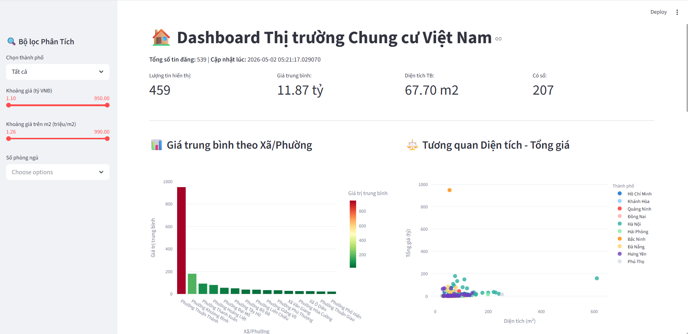
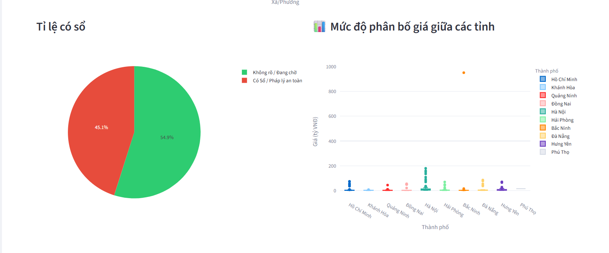
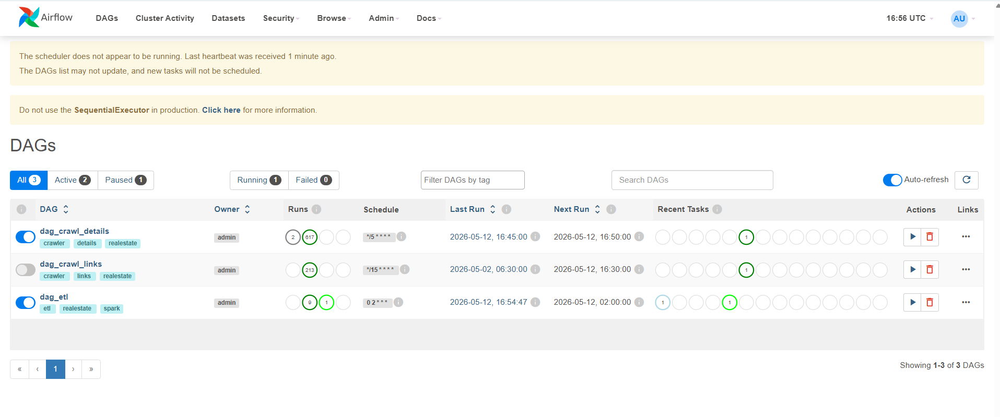
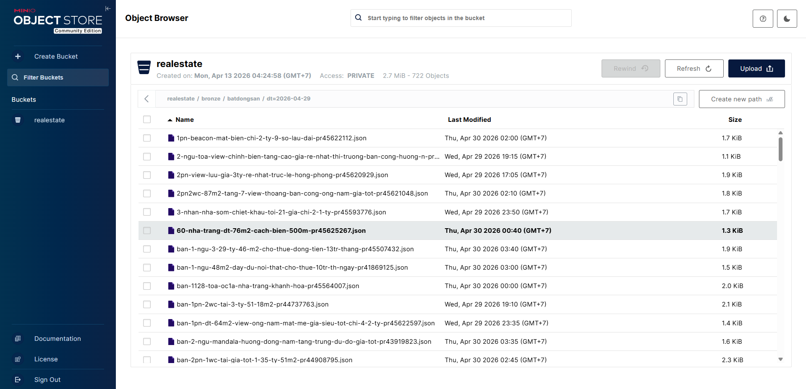
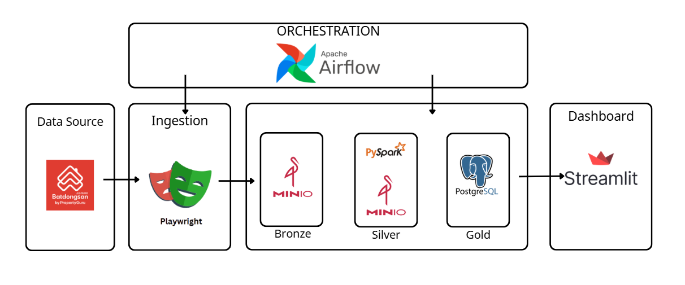

# Vietnam Real Estate Data Warehouse

[](https://www.python.org/)
[](https://airflow.apache.org/)
[](https://spark.apache.org/)
[](https://www.postgresql.org/)
[](https://www.docker.com/)

An end-to-end Data Warehouse system designed to collect, process, and visualize real estate data (specifically apartments) in Vietnam from [batdongsan.com.vn](https://batdongsan.com.vn).

---

## Project Screenshots

### 1. Streamlit Analytics Dashboard

*Track key metrics and filter real estate price data nationwide.*


*Detailed analysis of price distribution and legal status.*

### 2. Pipeline Management (Airflow)

*Automated 3-stage pipeline: Link Crawling -> Detail Crawling -> Spark ETL.*

### 3. Data Lake Storage (MinIO)

*Raw Bronze layer data stored as JSON in an S3-compatible MinIO object storage.*

---

## Architecture & Workflow



1.  **Data Collection:** Uses Playwright to scrape data, featuring city rotation and stealth anti-detection techniques.
2.  **Bronze Storage:** Scraped data is uploaded to **MinIO** as raw JSON objects.
3.  **Silver Processing:** **Apache Spark** cleans and re-formats the data, extracting administrative boundaries (District/City).
4.  **Gold Warehouse:** Spark handles deduplication and UPSERTs data into **PostgreSQL**, making it ready for analytics.
5.  **Visualization:** **Streamlit** connects directly to PostgreSQL to display interactive reports and insights.

---

## Tech Stack

| Component | Technology |
| :--- | :--- |
| **Scraping** | Playwright, BeautifulSoup4, Playwright-Stealth |
| **Object Storage** | MinIO (S3-compatible) |
| **ETL / Processing** | Apache Spark (PySpark) |
| **Database** | PostgreSQL 16 |
| **Orchestration** | Apache Airflow 2.7.1 |
| **Visualization** | Streamlit, Plotly |
| **Infrastructure** | Docker Compose |

---

## Project Structure

```bash
vn-realestate-warehouse/
├── airflow/dags/          # Pipeline definitions (Crawl & ETL)
├── crawler/               # Data scraping logic (Playwright + Stealth)
├── spark_jobs/            # ETL logic (Bronze -> Silver -> Gold)
├── dashboard/             # Streamlit Dashboard application
├── database/              # Database initialization scripts
├── docker-compose.yaml    # Full infrastructure configuration
└── .env.example           # Environment variables template
```

---

## Deployment Guide

### 1. Environment Setup
```bash
git clone https://github.com/<your-username>/vn-realestate-warehouse.git
cd vn-realestate-warehouse
cp .env.example .env
```

### 2. Run the System
```bash
docker compose up -d --build
```

### 3. Access Services
- **Airflow UI:** `http://localhost:8081` - Credentials: admin / admin
- **MinIO Console:** `http://localhost:9001` - Credentials: minioadmin / minioadmin
- **Dashboard:** `http://localhost:8501` (via Docker) or `streamlit run dashboard/app.py` for local execution.
